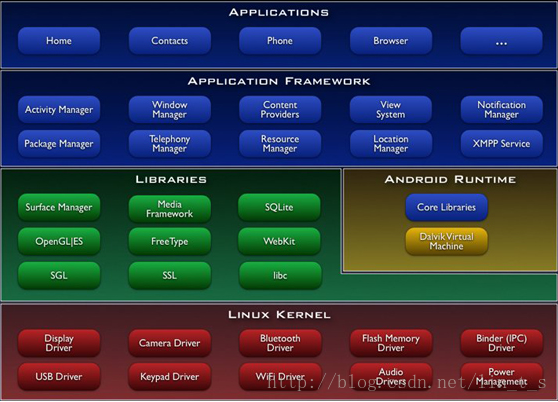

此技术文档主要是从基础了解Android系统架构，便于对以后开发形成一些基本应用架构。

     Android的系统架构采用了分层架构的思想，如图1所示。从上层到底层共包括四层，分别是应用程序程序层、应用框架层、系统库和Android运行时和Linux内核。
图1：Android系统架构图
  
  
      每层功能简要介绍如下：
## 一 应用程序层

      该层提供一些核心应用程序包，例如电子邮件、短信、日历、地图、浏览器和联系人管理等。同时，开发者可以利用Java语言设计和编写属于自己的应用程序，而这些程序与那些核心应用程序彼此平等、友好共处。

## 二 应用程序框架层
&ensp;   &ensp;   该层是Android应用开发的基础，开发人员大部分情况是在和她打交道。应用程序框架层包括活动管理器、窗口管理器、内容提供者、视图系统、包管理器、电话管理器、资源管理器、位置管理器、通知管理器和XMPP服务十个部分。在Android平台上，开发人员可以完全访问核心应用程序所使用的API框架。并且，任何一个应用程序都可以发布自身的功能模块，而其他应用程序则可以使用这些已发布的功能模块。基于这样的重用机制，用户就可以方便地替换平台本身的各种应用程序组件。XMPP(（Extensible Messaging and Presence Protocol，前称Jabber）是一种以XML为基础的开放式实时通信协议,XMPP网络是基于服务器的（即客户端之间彼此不直接交谈），但是也是分散式的。不像AOL实时通或MSN Messenger等服务，XMPP没有中央官方服务器。Jabber.org的公众服务器上有大量的用户，所以有些人误解了，以为它是官方服务器，不过事实上任何人都可以在自己的域名上运行XMPP服务器。

Jabber识别符（JID）是用户登录时所使用的账号，看起来通常像一个电子邮件地址，如someone@example.com；前半部分为用户名，后半部分为XMPP服务器域名，两个字段以@符号区隔。

假设朱丽叶（juliet@capulet.com）想和罗密欧（romeo@montague.net）通话，他们两人的账号分别在Capulet.com及Montague.net的服务器上。当朱丽叶输入信息并按下发送钮之后，一连串的事件就发生了：

朱丽叶的XMPP客户端将她的信息发送到Capulet.com XMPP服务器。
Capulet.com XMPP服务器打开与Montague.net XMPP服务器的连接。
Montague.net XMPP服务器将信息寄送给罗密欧。如果他目前不在在线，那么存储信息以待稍后寄送。
)
## 三 系统库和Android运行时

&ensp; &ensp;系统库包括九个子系统，分别是图层管理、媒体库、SQLite、OpenGLEState、FreeType、WebKit、SGL、SSL和libc。Android运行时包括核心库和Dalvik虚拟机，前者既兼容了大多数Java语言所需要调用的功能函数，又包括了Android的核心库，比如android.os、android.net、android.media等等。后者是一种基于寄存器的java虚拟机，Dalvik虚拟机主要是完成对生命周期的管理、堆栈的管理、线程的管理、安全和异常的管理以及垃圾回收等重要功能。–SQLite是遵守ACID的关系数据库管理系统，它包含在一个相对小的C程序库中;OpenGL-开放图形库（英语：Open Graphics Library，缩写为 OpenGL）是个定义了一个跨编程语言、跨平台的应用程序接口（API）的规范，它用于生成二维、三维图像。

## 四 Linux内核

Android核心系统服务依赖于Linux2.6内核，如安全性、内存管理、进程管理、网络协议栈和驱动模型。Linux内核也是作为硬件与软件栈的抽象层。驱动：显示驱动、摄像头驱动、键盘驱动、WiFi驱动、Audio驱动、flash内存驱动、Binder（IPC）驱动、电源管理等。

## 总结：

- 1 Android的系统架构采用分层架构的思想，架构清晰，层次分明，协同工作。
- 2 Android的系统架构不仅从宏观上认识了Android系统，同时，也给我们的学习与实践指明了方向。若是从事Android应用开发，那应该研究Android的应用框架层和应用程序层；若是从事Android系统开发，那应该研究Android的系统库和Android运行时；若是从事Android驱动开发，那应该研究Android的Linux内核。总之，找准切入点，实践出真知。

## 一．android系统架构图及各层介绍

### 1.应用层
应用是用java语言编写的运行在虚拟机上的程序，比如Email客户端，SMS短消息程序，日历等。

### 2.应用框架层
这一层是编写Google发布的核心应用时所使用的API框架，开发人员同样可以使用这些框架来开发自己的应用，这样便简化了程序开发的结构设计，但是必须要遵守其框架的开发原则。

### 3.系统运行库（C/C++库以及Android运行库）层
当使用Android应用框架时，Android系统会通过一些C/C++库来支持我们使用的各个组件，使其更好的为我们服务，比如其中的SQLite（关系数据库），Webkit（Web浏览器引擎）。

### 4.Linux内核层
Android的核心系统服务给予Linux2.6内核，如安全性、内存管理、进程管理、网络协议栈和驱动模型等都依赖于该内核，比如Binder IPC(Internet Process Connection进程间通信)驱动，android的一个特殊驱动程序，具有单独的设备节点，提供进程间通信的功能。

## 一．框架提供的功能

Android系统提供给应用开发者的本身就是一个框架，所有的应用开发都必须遵守这个框架的原则。我们在开发应用时就是在这个框架上进行扩展，